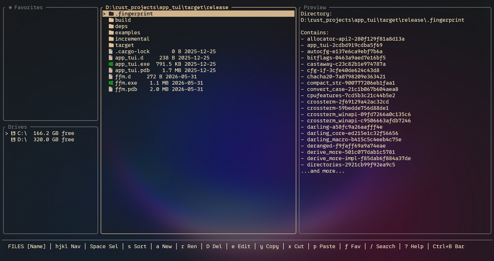

<div align="center">
# ⚡ FastyFileManager

**A blazing-fast terminal file manager built with Rust & Ratatui**

[](https://www.rust-lang.org/)
[](LICENSE)
[](https://github.com/SMOLDEVI/FastyFileManager)

</div>

---

## ✨ Features

- 🗂️ **Three-panel layout** — Favorites, Drives, Files, and Preview
- 📋 **Clipboard** — Copy, Cut and Paste files & folders (recursive)
- ★ **Favorites** — Pin any file or folder for instant access (persisted between sessions)
- 🔍 **Fuzzy Search** — Instantly filter files as you type
- 🎨 **Nerd Font icons** — Per-extension color coding and icons
- ⚙️ **Configurable** — Full keybinding and theme customization via `config.toml`
- 🖊️ **Editor integration** — Open files in your `$EDITOR` (nvim, vim, nano…)
- 💾 **Hot config reload** — Apply changes without restarting

---

## 📸 Screenshot

<!-- Add your screenshot here -->
<div align="center">

</div>

---

## 🚀 Installation

### Prerequisites

- [Rust](https://rustup.rs/) (stable, 1.75+)
- A terminal with [Nerd Fonts](https://www.nerdfonts.com/) support (e.g. JetBrainsMono Nerd Font)

---

### 🐧 Linux / macOS

```bash
git clone https://github.com/SMOLDEVI/FastyFileManager.git
cd FastyFileManager
chmod +x build.sh
./build.sh
```

The script will:
1. Compile the project in release mode
2. Place the `ffm` binary in the project directory
3. You can then move it to `~/.local/bin/` or `/usr/local/bin/` to add it to PATH

```bash
# Optional: add to PATH manually
cp ffm ~/.local/bin/ffm
```

---

### 🪟 Windows

```bat
git clone https://github.com/SMOLDEVI/FastyFileManager.git
cd FastyFileManager
build.bat
```

The script will:
1. Compile the project in release mode
2. Copy `ffm.exe` to `%USERPROFILE%\bin\`
3. Automatically add `%USERPROFILE%\bin` to your user `PATH`

> ⚠️ Restart your terminal after first install for PATH changes to take effect.

---

### 📦 Manual build

```bash
git clone https://github.com/SMOLDEVI/FastyFileManager.git
cd FastyFileManager
cargo build --release
# Binary is at: target/release/ffm  (or ffm.exe on Windows)
```

---

## ⌨️ Keybindings

### 🗂️ File Panel

| Key | Action |
|-----|--------|
| `j` / `↓` | Move down |
| `k` / `↑` | Move up |
| `l` / `→` / `Enter` | Open directory |
| `h` / `←` / `Backspace` | Go to parent directory |
| `a` | Create new file or folder (end name with `/` for folder) |
| `D` | Delete selected file/folder |
| `e` | Open file in `$EDITOR` |
| `y` | **Copy** selected item to clipboard |
| `x` | **Cut** selected item (move) |
| `p` | **Paste** clipboard into current directory |
| `f` | Add selected item to **Favorites** |
| `/` | Start search / filter |
| `Tab` | Switch focus: Files → Drives → Favorites |

### ★ Favorites Panel

| Key | Action |
|-----|--------|
| `j` / `↓` | Move down |
| `k` / `↑` | Move up |
| `Enter` / `→` | Navigate to favorited item |
| `D` or `F` | Remove from favorites |
| `Tab` | Switch focus |

### 💾 Drive Panel

| Key | Action |
|-----|--------|
| `j` / `↓` | Move down |
| `k` / `↑` | Move up |
| `Enter` / `→` | Switch to selected drive |
| `Tab` | Switch focus |

### 🔍 Search Mode

| Key | Action |
|-----|--------|
| *type anything* | Filter files in real time |
| `Enter` | Confirm and return to Normal mode |
| `Esc` | Cancel search and clear filter |
| `↑` / `↓` | Navigate filtered results |

### 🌐 Global

| Key | Action |
|-----|--------|
| `q` | Quit |
| `F5` | Hot-reload config |
| `Ctrl-h` | Focus Drives panel |
| `Ctrl-l` | Focus Files panel |

---

## ⚙️ Configuration

Config is stored at:
- **Windows**: `%APPDATA%\ffm\config.toml`
- **Linux/macOS**: `~/.config/ffm/config.toml`

The file is auto-created on first run with default values.

```toml
[theme]
background     = "Reset"
text           = "#EADBB8"
selected_bg    = "#D2B48C"
selected_fg    = "#282828"
directory      = "#E0C097"
file           = "#C8B6A6"
highlight_symbol = "> "

[keys]
quit         = "q"
search       = "/"
cancel       = "esc"
submit       = "l"
down         = "j"
up           = "k"
delete       = "D"
create       = "a"
focus_files  = "ctrl-l"
focus_drives = "ctrl-h"
back_dir     = "h"
reload       = "F5"
edit         = "e"
help         = "p"
```

> Apply changes instantly with `F5` — no restart needed!

---

## 🏗️ Project Structure

```
FastyFileManager/
├── src/
│   ├── main.rs      # Entry point
│   ├── app.rs       # Application state & input handling
│   ├── ui.rs        # Terminal UI rendering (ratatui)
│   ├── config.rs    # Config loading & defaults
│   ├── icons.rs     # File type icons & colors
│   └── theme.rs     # Color parsing
├── build.sh         # Linux/macOS build + install script
├── build.bat        # Windows build + PATH setup script
└── Cargo.toml       # Dependencies
```

---

## 📄 License

MIT © [SMOLDEVI](https://github.com/SMOLDEVI)
